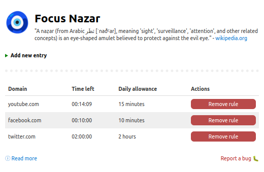
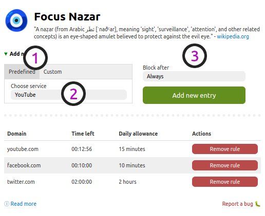
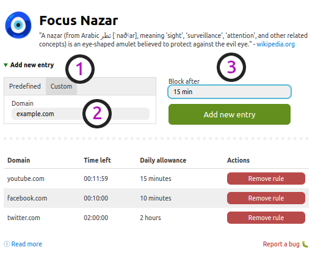

<h1>
 Focus Nazar
</h1>

    
    <a href="#" title="GitHub Repository">Chrome Web Store</a>

    "A naẓar (from Arabic ‏نَظَر‎ [ˈnaðˤar], meaning 'sight', 'surveillance', 'attention', and other related
    concepts) is an eye-shaped amulet believed to protect against the evil eye." - <a
    href="https://en.wikipedia.org/wiki/Nazar_(amulet)" title="Nazar Amulet" target="_blank">wikipedia.org</a>

<h2 style="width: 500px; margin: 30px auto 0 auto; padding: 20px; border: 4px solid #ccc; text-align: center;">
    Focus Nazar is a Chrome Extension helping you to manage your focus.
</h2>

    You can choose you most "focus disrupting" services and <strong>limit their daily intake time</strong> or <strong>blocking them
    altogether</strong>.

    

<h1 style="margin-top: 60px;">Guides</h1>

    

        <h5>Adding predefined domain</h5>
        <ol style="font-size: 0.9em;">
            <li>Choose the "Predefined" tab</li>
            <li>Select your desired target</li>
            <li>Define daily limit or block altogether</li>
            <li style="color: #689112">Add new entry!</li>
        </ol>
        
    

    

        <h5>Adding custom domain</h5>
        <ol style="font-size: 0.9em;">
            <li>Choose the "Custom" tab</li>
            <li>Fill input with desired domain</li>
            <li>Define daily limit or block altogether</li>
            <li style="color: #689112">Add new entry!</li>
        </ol>
        
    

